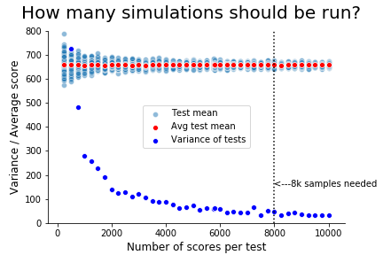
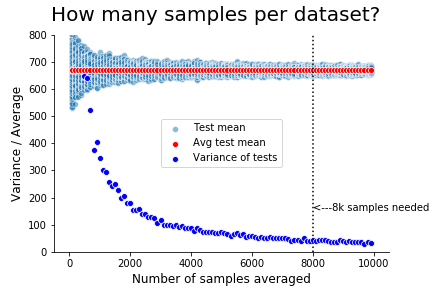
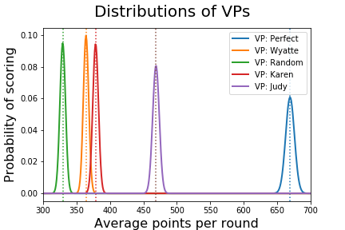

# Boxcar
### 7.16.2020
### Gavin Ray, Galvanize DS-RFT4 Capstone One

While play styles, techniques, and theory is well documented for popular games like chess, the simple yet elegant game of Boxcar is still widely unknown. This  Boxcar Simulator is able to define a standard of evaluation for the game in order to help player improve their scores. It utilizes several simple Virtual Players (VPs) that represent the most common play styles. By running through the simulation, human players can compare themselves to the built in VPs, and gain insight into their own ability.

This readme is split into two phases. The first describes the simulation and how to it is used. The VPs are described in detail, and an analysis of their abilities is provided. Standards for testing have also been set. The second phase gives an example of one player who benefited from using this simulation. For more information on the calculation used, please see the Jupyter Notebook located in the directory labeled 'eda'. 

## Phase One:

### Defining Test Parameters
Before running the simulation and comparing our VPs, it is important that we define how our tests will be performed. It is easy to run numerous simulations on our VPs in a short amount of time, and have chosen to require 8,000 samples each before starting analysis. In addition, we will also utilize the Central Limit Theorem by taking the mean and standard deviation of 8,000 samples taken from the original data with replacement. The resulting distributions of the means are shown below.

 

### Comparing VPs

Now we are ready to start talking about our Virtual Players! In this game, players are repeatedly given one choice--roll or stay? To make this decision, the player mainly looks at how many dice will be used if rolling, and how many points will be made if staying. These VP utilize various strategies to make this decision. As you would expect, some are better than others.

- Random: Just like it sounds, this VP chooses randomly whether to roll or stay. It is intended as a lower boundary benchmark. If you can't beat the random VP, you should probably move on to a different game. 
- Wyatte: This VP represents players who are only concerned with dice probabilities. Because it is less than probable to score with 2 or less dice, this VP will always stop rolling when it has only 2 dice available. Likewise, it will keep rolling whenever it has 3 or more dice available.
- Karen: For this VP, score is considered first. There is a popular belief in Boxcar communities that one should always roll with less than 350 points, but never when over 1000. This VP follows this ancient wisdom. When the score is between these two points, it follows the same logic as Wyatte.
- Judy: The most sophisticated VP, Judy uses 6 different algorithms. It represents an experienced player with a deep understanding of both dice probabilities and the game's scoring mechanics. Although it is definitely beatable, this VP represents a good benchmark for most players to aim for.
- Perfect: This VP always rolls, and is evaluated without a loss condition. It represents the scores of a person who can tell the future, and therefore knows exactly when to stop rolling. For our purposes, it represents the upper boundary of what is possible even though it's performance is impossible to replicate without cheating.

## Phase Two
