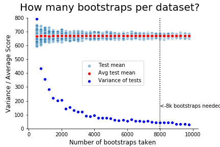
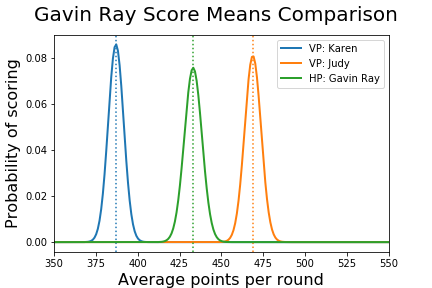
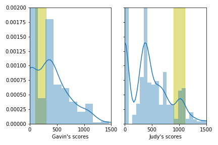
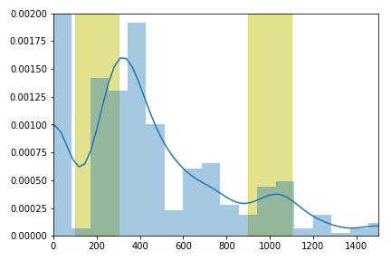
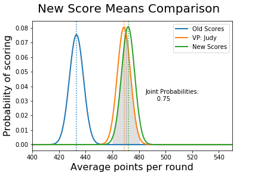

# Boxcar
### 7.16.2020
### Gavin Ray, Galvanize DS-RFT4 Capstone One

While play styles, techniques, and theory is well documented for popular games like chess, the simple yet elegant game of Boxcar is still widely unknown. This  Boxcar Simulator is able to define a standard of evaluation for the game in order to help player improve their scores. It utilizes several simple Virtual Players (VPs) that represent the most common play styles. By running through the simulation, human players can compare themselves to the built in VPs, and gain insight into their own ability.

This readme is split into two phases. The first describes the simulation and how to it is used. The VPs are described in detail, and an analysis of their abilities is provided. Standards for testing have also been set. The second phase shows a deeper explanation into how one might use this simulation skill level. 

For more information on the python code used to make the graphs, please see the Jupyter Notebook located in the directory 'eda'. All the simulation files are locdated in 'src', including a second readme that explains the

## Phase One:

### Scores Distribution

An initial evaluation of scores from the Perfect VP lets us see that we are dealing with a very unique distribution shape. Because of this, I'm going to utilize the central limit theorem to define distributions of the mean scores for each VP. Comparing these distributions will be much easier to analyze. 

Before running the simulation and comparing our VP's means, I want to define how the tests should be be performed. It is easy to run numerous simulations on our VPs in a short amount of time, but I also do not want to discourage others from repeating my experiment based on processing time. So, we will collect 8,000 samples from each VP before starting analysis, and then bootstrap 8,000 samples from the original data with replacement. The process by which I arrived at this number is shown below.

 

### Comparing VPs

Now we are ready to start talking about our Virtual Players! In this game, players are repeatedly given one choice--roll or stay? To make this decision, the player mainly looks at how many dice will be used if rolling, and how many points will be made if staying. These VP utilize various strategies to make this decision. As you would expect, some are better than others.

- Random: Just like it sounds, this VP chooses randomly whether to roll or stay. It is intended as a lower boundary benchmark. If you can't beat the random VP, you should probably move on to a different game. 
- Wyatte: This VP represents players who are only concerned with dice probabilities. Because it is less than probable to score with 2 or less dice, this VP will always stop rolling when it has only 2 dice available. Likewise, it will keep rolling whenever it has 3 or more dice available.
- Karen: For this VP, score is considered first. There is a popular belief in Boxcar communities that one should always roll with less than 350 points, but never when over 1000. This VP follows this ancient wisdom. When the score is between these two points, it follows the same logic as Wyatte.
- Judy: The most sophisticated VP, Judy uses 6 different algorithms. It represents an experienced player with a deep understanding of both dice probabilities and the game's scoring mechanics. Although it is definitely beatable, this VP represents a good benchmark for most players to aim for.
- Perfect: This VP always rolls, and is evaluated without a loss condition. It represents the scores of a person who can tell the future, and therefore knows exactly when to stop rolling. For our purposes, it represents the upper boundary of what is possible even though it's performance is impossible to replicate without cheating.

## Phase Two

Now it's time to introduce a human element. After playing the game 500 times via the terminal, I plotted my data alongside the VPs. Here's what I found:

It looks like I'm better than Karen, but not as good as Judy! This might surprise you. Seeing how I wrote the Judy VP algorithms, why is it that I'm not just as good? 

When writing the Judy VP, I simply guessed at which values to use for each algorithm. To be honest, I had no idea if it would be a good player or not! Now that I know it is better than I am, it's time to analyze the distribution to try and figure out just how the Judy VP is gaining better scores.

What I found was that I'm recording more scores in the 100 to 300 range, while the Judy VP is scoring more in the 900 to 1100 range! Is it possible for me to change my playstyle to better match Judy by rolling more often when the scores are low? I ran the simulation again, and plotted my scores a second time. What I found was a definite increase in my mean scores, and a distribution that looks much more similar to Judy.

In order to determine the p-value difference between these distributions, I used the Koglomorov Smirnov hypothesis test. Comparing the first round of my scores with the second round gives me a p value of .0066. This shows enough difference to say that the distribution of my scores has changed! 

Plotting a distribution of the means of my new scores along with the old lets us see just how much better I have become.

